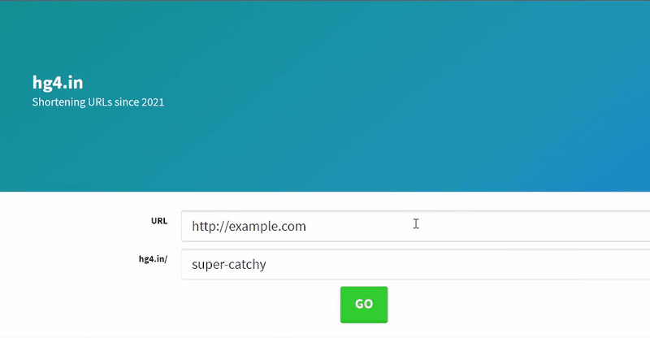

# Custom-URL-Shortener

Make any long URL short, also can give your custom slug-key.

- here - [hg4.in](https://www.hg4.in)

## Demo

## Tech Stack

**Client:** Veu.js (CDN) , bulmaCSS (basic)

**Server:** Node, Express, Mongodb/Monk

## Roadmap

- Setup a Node/Express server

- Used morgan for console logging, and body-parser.

- Created client with bulmaCSS.

- Setup a Mongodb connection using Monk.

  - Create route to add url to db /api/url.

  - validate URL with joi.

  - url - name alphanum, min 1 chars, max 100 chars.

  - Make sure name is not in use, Respond with error if in use.

- Deployed on Heroku and MongoDB atlas.
